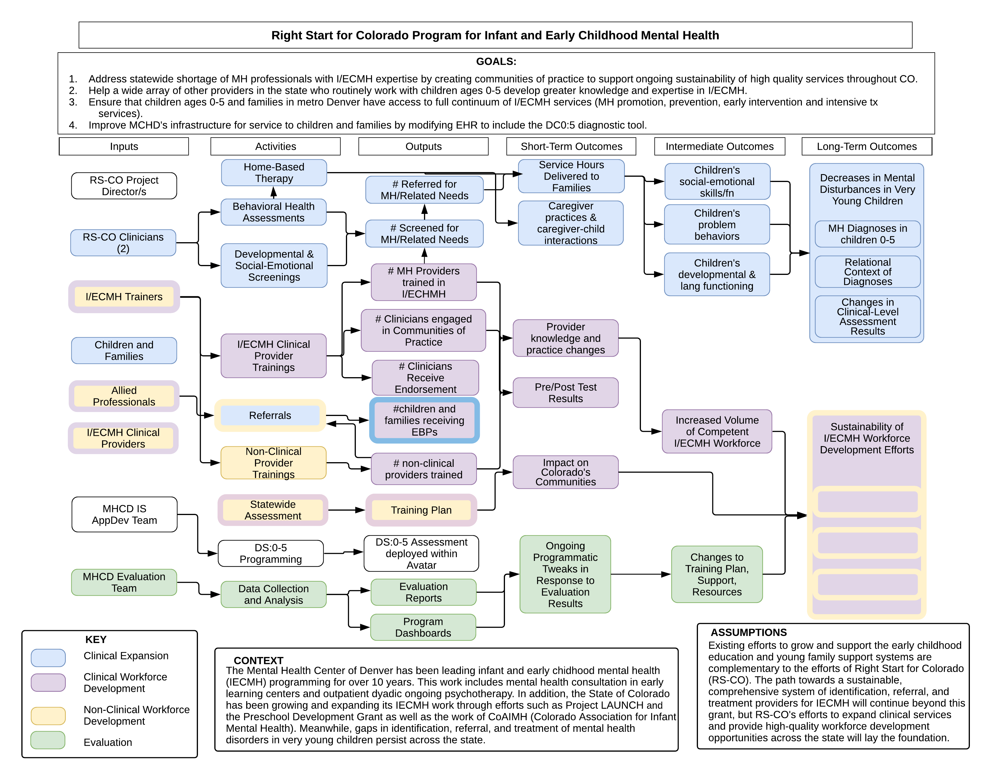
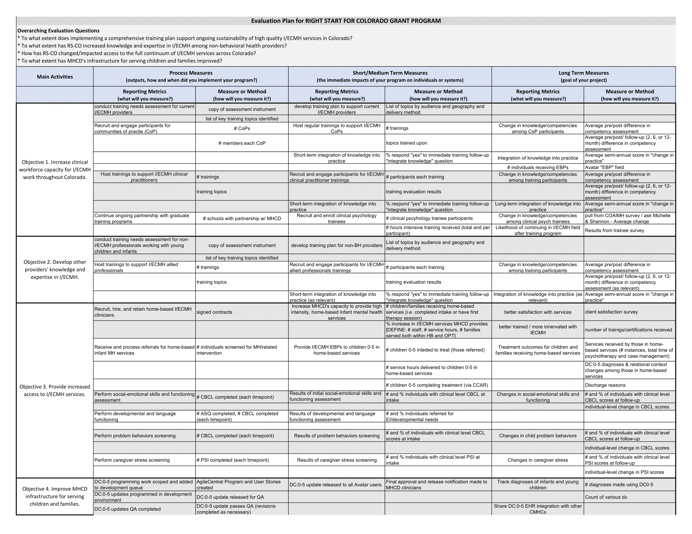
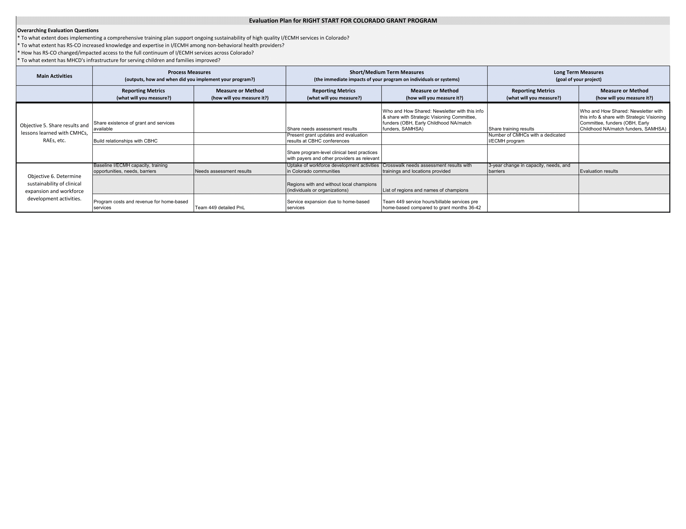
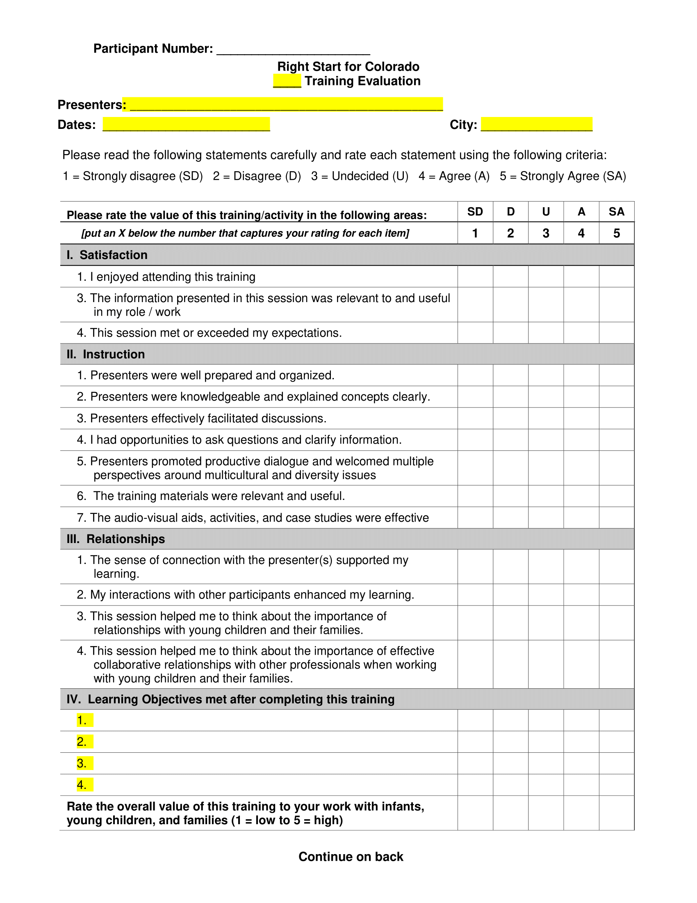

```{r setup, include=FALSE}
knitr::opts_chunk$set(echo = TRUE)
library(kableExtra)
library(lubridate)
library(tidyverse)
library(likert)
library(data.table)
#Set FY
FYlong = 'fiscal year 2019'
FYshort = 'FY19'

source('Initial_Training_Data_PrepAnalysis.R', echo = TRUE)
source('Initial_Clinical_Data_PrepAnalysis.R', echo = TRUE)
source('Annual_GoalsandDIS.R', echo = TRUE)
```

#Grantee Contact Information
**Grant Year:** Year 1, Fiscal Year 2019 (September 30, 2018 -September 29, 2019)   
**Grantee Name:** Mental Health Center of Denver  
**Grant Number:** 6H79SM081761-01M001   
**Project Director Name:** Shannon Bekman, PhD, IMH-E  
**Person(s) Completing Report:** Shannon Bekman, PhD, IMH-E; Nicole Harty, MPH
    
[Abbreviations Used in Report](#Abbreviations)

#Program Description
Right Start for Colorado is a five-year Substance Abuse and Mental Health Services Administration-funded (SAMHSA) initiative led by the Mental Health Center of Denver (MHCD) to support the growth and development of infant and early childhood mental health services across the state of Colorado. Additional funding comes from the Colorado Early Childhood Mental Health Funders Community (including Communities First Foundation, Piton Foundation, and Zoma Foundation).  

Right Start for Colorado seeks to build a strong, competent infant mental health workforce that can meet the needs of young children ages 0-5 and families across Colorado. In alignment with our initial grant application and the legislative intent behind these SAMSHA funds, the goal of Right Start for Colorado is to increase access to a full range of infant and early childhood mental health services at the community level, and to build statewide workforce capacity for individuals serving the birth to 5 population across Colorado by increasing knowledge of infant mental health principles and practices. The scope of this project is both local to metro Denver through an expansion in MHCD’s clinical infant mental health services and statewide through a range of workforce development activities.  

The two long term outcomes we aim to move the needle on with this 5-year grant are:  

* To have a robust statewide community of mental health professionals with expertise in infant/early childhood mental health that can meet the social-emotional needs of young children (ages 0-5), pregnant individuals, and families across Colorado.  
* To have a robust allied provider network that understands infant/early childhood mental health and feels competent and confident identifying and referring young children ages 0-5 in need of infant and early childhood mental health services.  

Given the above long-term outcomes, we identified four programmatic goals with specific objectives in our grant application that we have been dutifully working towards in this first year of the grant:   

**Goal 1**: Address Colorado’s statewide shortage of mental health professionals with infant and early childhood mental health expertise by creating communities of practice to support ongoing sustainability of high quality IECMH services available throughout Colorado.   

  * *Objective 1.1*: In Years 1 and 2, conduct a needs assessment to identify at least three Colorado communities interested in and in need of developing a community of practice. Work with each community to determine what trainings/support would best fit their needs. Use telehealth strategies to facilitate training/support for these communities. Unduplicated number of staff, clinicians and students to be trained: **10** per community of practice; **30** over course of grant.  
  * *Objective 1.2*: Increase the number of clinicians entering the workforce with IECMH expertise by offering clinical psychology externships, pre-doctoral internships and/or post-doctoral fellowships focused on IECMH. Unduplicated number of students to be trained intensively: **3** annually beginning in Year 2; **12** over course of project.  

**Goal 2**: Train a wide array of other providers who routinely work with the 0-5 population develop greater knowledge and expertise in IECMH. This includes child welfare workers, home visitors, pediatricians/PCPs, early childhood education professionals, early interventionists, public health nurses, etc.)  

  * *Objective 2.1*: In Years 1 and 2, conduct a statewide needs assessment of providers to determine community readiness and gaps/needs, identify best practices, create a statewide training plan and pilot test the training to at least 150 child/family-serving providers in metro Denver. In Years 3-5, train at least 375 additional providers statewide to improve awareness and knowledge of IECMH principles and practices. Unduplicated number of providers to be trained: **50** in year 1, **100** in year 2; **125** annually in years 3-5; **525** over course of grant.  

**Goal 3**: Ensure that young children ages 0-5 and families in metro Denver have access to the full continuum of IECMH services including mental health promotion, prevention, early intervention, and intensive treatment services.  

  * *Objective 3.1*. Expand MHCD’s current service continuum by adding a high intensity, home-based infant mental health program.    
  * *Objective 3.2*: Provide treatment using IECMH evidence-based treatments to children ages 0-5 and their families with intensive, in-home psychotherapeutic services. Unduplicated number of children we intend to treat: **30** annually; **150** over course of project.

**Goal 4**: Improve MHCD’s infrastructure for serving young children and families by modifying the electronic health record to include DC:0-5 diagnosis.  

* *Objective 4.1*: By December 31, 2019, the DC:0-5 will be programmed into MHCD’s electronic health record so that the DC:0-5 can be used to diagnose persons receiving services.  

To accomplish these goals, the Right Start for Colorado team is comprised of a Project Director (Shannon Bekman, PhD), Clinical Program Manager (Michelle Roy, PhD), Lead Evaluator (Nicole Harty, MPH), two home-based clinicians, and an executive project assistant. We partner closely with numerous statewide and regional community organizations and rely upon evaluation services within the Mental Health Center of Denver’s Information Systems department.

#Program Activities
In accordance with the SAMHSA Infant and Early Childhood Mental Health Grant Program guidelines, Right Start for Colorado encompasses a range of activities aimed to expand infant/early childhood mental health services across Colorado communities by building statewide workforce capacity for professionals serving young children birth to 5 years of age and their families.

##Mental Health Promotion, Prevention & Screening
###Project Activities
In our grant proposal, we described Mental Health Center of Denver’s stance as a state and regional expert in infant and early childhood mental health and shared our intent to expand clinical services for young children and families at MHCD. Despite our robust prevention programming, which includes early childhood mental health consultation services, the Providers Achieving School Outcomes (PASO) FFN program, Incredible Years programming and our outpatient IECMH treatment services, our clinical service array had not previously included an intensive, home-based treatment option for families whose complex clinical presentation was beyond what our outpatient IECMH program could address. The Right Start for Colorado grant brought these critically important intensive services to Denver, where there were no other organizations offering this treatment option. At this time, Mental Health Center of Denver is now able to offer a full continuum of services including promotion, prevention, early intervention and treatment, including both outpatient and higher intensity home based levels of care. This home-based option allows us to serve families whose clinical needs require more frequent or intensive services as well as those who are typically hard to engage at an outpatient level.

###Major Accomplishments
Our major accomplishments include the hiring and onboarding of two seasoned infant/early childhood mental health clinicians and the implementation of this new line of in-home treatment services in the first quarter of year 1 of the grant, as required per SAMHSA guidelines. Additionally, as intended, one of the two clinicians is Spanish/English bilingual so that we can meet the need for clinical service provision in Spanish, given the large demographic of Spanish speaking families seeking our services. The clinicians are trained in (or are currently receiving training in) evidence-based treatments for the birth to 5 population including Child Parent Psychotherapy, Parent Child Interaction Therapy, Circle of Security and Trauma Focused-Cognitive Behavioral Therapy.  

With regard to clinical service provision, we exceeded almost all of our goals (details below in SPARS reporting section). This year we screened 351 individuals for mental health and related needs and referred 92 of these individuals to our home-based Right Start for Colorado therapists. (Of those not referred to home based services, the vast majority received treatment with our existing outpatient IECMH team). We referred an additional 11 individuals to other MHCD programs, and early intervention Part C services or other external services. We provided in-home mental health services to 34 dyads, including 68 individual young children and their caregivers. 72% of all individuals we referred for home-based dyadic and adult psychotherapy, case management, early intervention services accessed the services for which they were referred.  

In addition to quantitative measures of performance, we developed and implemented processes to track changes in clinical outcomes associated with treatment progress. We are having families complete a number of pre- and post- assessment measures including the Child Behavior Checklist (when age appropriate), the Parenting Stress Index, and the Symptom Checklist 90 - Revised. Furthermore, all young children receive an Ages and Stages Questionnaire to monitor attainment of developmental milestones, and referrals are made to Part C early intervention services when indicated. Additionally, all caregivers are being screened with the Edinburgh Postnatal Depression Scale. Lastly, the reception from the Denver community to this new line of services has been enthusiastic. Particularly, our fellow home-based programs such as Nurse Family Partnership, HIPPY and Parents as Teachers as well as our colleagues at child welfare have all been excited to have a home-based treatment option to which they can refer their families. 

###Challenges/Barriers
One challenge we have encountered is how to best identify families who are most appropriate for our in-home treatment services as compared to our outpatient IECMH services. Our goal is to base this determination on the clinical complexity with which the families present, with the most challenging clinical presentations requiring more frequent or intensive services to receive our home-based treatment services. While we have been making decisions with this criterion in mind, there are times we think a family would benefit from in-home services and yet they decline this option for a variety of reasons (e.g., lack of trust due to prior child welfare involvement). In other situations, we would have wanted to provide in-home services, but environmental factors preclude it (e.g., multiple generations of family living in home such that there would be no privacy for delicate clinical conversations; domestically violent partner in the home, such that caregiver feels unsafe having conversations about trauma in her home). Other times we do not think in-home intensive services are warranted but referring providers or families themselves would prefer it (i.e., due to transportation or childcare challenges). Holding all these variables in mind, we strive to make the best and most fair clinical decisions we can about treatment service provision to meet the needs of young children and families residing in Denver. To assist us, we are actively pursuing the possibility of incorporating the Early Childhood Service Intensity Instrument (ECSII) into our clinical decision-making process. 

Other challenges of note include the difficulty of trying to maintain fidelity to an evidence-based treatment model (or comprehensive IECMH assessment process) in a non-standardized, and at times chaotic home environment. For example, there are cases we are treating for posttraumatic stress disorder where multiple siblings have experienced a trauma and given differing cognitive capacities, intensity of traumatic exposure and ways of coping, we would ideally choose for them to each have their own separate dyadic treatments.However, in the home environment with lack of childcare and the inability to restrict family members’ whereabouts, we find that we must provide services creatively and be flexible with treatment fidelity at times. 

Finally, we are experiencing the predictable challenge of navigating a congested urban metropolis while trying to efficiently provide home-based services to maximize the number of families we can serve at any one point in time with two home-based clinicians. 

###Solutions/Lessons Learned
Initially, all clinicians providing infant mental health services (i.e., outpatient and home based) were conducting initial screening appointments to determine the appropriate level of service for clinically-referred children and families. These were being conducted in the office to promote engagement for families, as well as ensure safety and provide an opportunity to meet families and assess potential safety issues prior to entering their home. While this was helpful in some contexts, it added a few challenges: the home-based clinicians needed to coordinate scheduling around being available in the office, and some families had such significant barriers that they were unable to even attend one appointment in the office. The solution currently arrived at is to have home-based services begin in the home from the first session when this need is identified, as well as to have outpatient clinicians screen families in the office and then refer to home-based services if applicable.

To address the challenge of maintaining fidelity to IECMH best practice in assessment and intervention, we sought consultation with others doing this work to learn about considerations they hold in mind. Additionally, we have consulted with national trainers in Child Parent Psychotherapy and Parent Child Interaction Therapy around considerations for implementing these modalities in the home. In general, we have found that conversations around choice of treatment modality are also informed by factors present in the home, such as whether siblings or extended family are present, and what areas in the home are accessible/appropriate for use in the therapy session. We were encouraged by trainers to consider what tenets of each modality are unique and vital, and how to hold these while being more flexible with other factors. Additionally, given the added complexity of work in the home, we are learning that treatment may at times have a longer course than in an outpatient setting.

In order to maximize the number of families we can serve at any one time, given the size and shape of Denver county, we are trying (when possible) to assign cases to the two home based clinicians based on physical location within the city in order to minimize amount of time spent in transit.


###Progress Toward Sustainability
The home-based clinicians’ caseloads are at capacity and acceptance of new referrals is becoming dependent on other families’ completion of treatment. We are hopeful that the expansion of these IECMH clinical services will be sustained after grant funding ends, especially since the need is clearly demonstrable and community uptake has been swift. We are currently tracking revenue brought in by these services (i.e., including our Medicaid offsetting revenue) as compared with the full costs to provide this level of care. While we cannot guarantee the financial state in 2023 when the grant ends, we have a strong case to continue this line of intensive treatment services. 

In order to support our case for sustainability, we are beginning to compare data between the outpatient and home-based levels of service to continue to refine service delivery. A component of this program refinement is to incorporate the ECSII, mentioned above, to identify level of service at the time of initial mental health services screening (the behavioral health assessment). Furthermore, as more families complete home-based treatment (which we expect to generally average 10-12 months in duration), we can begin to analyze pre- and post- assessment data to show the treatment gains and benefits of this new line of service. 

##Mental Health Consultation
Right Start for Colorado did not write early childhood mental health consultation activities into our grant application. We had chosen to focus our efforts on the other three activity areas outlined in the funding opportunity announcement; however, we would like to note that numerous ECMH consultants have attended a number of our training offerings (detailed below) in this first year of the grant.

##Trainings for Mental Health Clinicians and Other Child- and Family-Serving Providers
###Project Activities
The delivery of trainings for mental health clinicians and other ‘allied providers’ who frequently work with very young children and their families encompasses a substantial portion of our grant efforts. In our application, we highlighted our overarching goal to build a strong, competent infant mental health workforce that can meet the needs of young children and their families across Colorado. We conceptualize this workforce as two complementary and interdependent groups of professionals who cross-refer to ensure the thriving welfare of Colorado’s youngest citizens. The two long term outcomes we aim to achieve include: (1) to have a strong and skilled statewide community of *mental health* professionals with expertise in infant/early childhood mental health who can meet the socio-emotional needs of young children (ages 0-5) and their families across Colorado and (2) to have a robust *allied provider network* that understands infant/early childhood mental health and feels competent and supported in identifying and referring very young children and their families for appropriate assessment and intervention. Given these long term outcomes, we are focused on the following two workforce development goals: (1) Address Colorado’s statewide shortage of mental health professionals with infant/early childhood mental health expertise and improve the quality of mental health services available to young children and families; and (2) Train a wide array of other providers who routinely work with the 0-5 population (i.e., child welfare workers, home visitors, pediatricians/PCPs, early childhood education professionals, early interventionists, public health nurses, first responders, etc.) develop greater knowledge and expertise in IECMH. 

###Major Accomplishments
Given our identified training goals, our first priority was to conduct a statewide needs assessment (discussed in greater detail under System Improvements below) to directly inform the development of a statewide training plan. While the statewide needs assessment is still underway (and scheduled to be completed February 28, 2020), we focused the first year of our training efforts predominantly in metro Denver, where given our work over the past 10 years we felt closer to the pulse of what was needed, had organizational relationships already established and could pilot the reception to our offerings. 

In accordance with our grant proposal, we offered a number of trainings in this first year for both our clinical and allied IECMH workforce:  

1. *DC:0-5 Diagnostic Training Institutes*: We offered 4 official DC:0-5™ clinical training institutes to **`r RegistDemo %>% filter(TrainingTopic=="DC:0-5") %>% filter(Attended=='Yes', FiscalYear==FYshort) %>% count()+12`** providers in metro Denver and Colorado Springs.The DC:0-5™ Diagnostic Classification of Mental Health and Developmental Disorders of Infancy and Early Childhood is a developmentally sensitive, relationship-based, contextual and culturally responsive approach to diagnosis. This two-day training guides clinicians through best practices of IECMH assessment and offers a framework for clinical conceptualization of mental health challenges in the 0-5 population. Although the DC:0-5 was published in late 2016, most IECMH clinical providers across Colorado have not been trained in its use. While several trainings were offered in 2017-2018, they were limited predominantly to the state’s early childhood mental health consultants who had access to trainings given federal Project Launch and local Launch Together funding. With our IECMH SAMHSA project, we were able to train most of the IECMH providers in metro Denver and will continue to offer in Denver as needed as well as disseminate in other parts of the state. In addition to the 4 training institutes, the Project Director has served as a central coordinating entity for the 12 statewide certified DC:0-5 trainers. This includes developing uniform cost guidelines for trainers, developing pre- and post-tests for trainers to use to assess effectiveness of the training as well as hosting a Basecamp website for trainers to communicate, coordinate and ask for support as they roll out their first trainings.   
2. *Diversity-Informed Tenets for Work with Infants, Children and Families*: In August 2019, we brought together **`r RegistDemo %>% filter(TrainingTopic=="Diversity-Informed Tenets") %>% filter(Attended=='Yes', FiscalYear==FYshort) %>% count()`** professionals from various disciplines including early intervention, pediatrics, family medicine, nurse home visitation, early childhood mental health consultation and infant/early childhood treatment for a day focused on increasing our self-awareness around racism, privilege, unconscious bias and intersectionality particularly as it relates to our work serving young children and their families. Dr. Karen Frankel and Carmen Rosa Noroña facilitated this full day training which received strong reviews from participants including one participant noting, “I felt a part of something bigger than myself.” Given the importance of cultivating space for this kind of self-reflection, we plan to continue to offer the Tenets each year of the grant and vary the location throughout different Colorado regions beginning in year 3.   
3. *Health Equity Training*: In addition to the Tenets training above we partnered with the Colorado Association for Infant Mental Health in February 2019 to co-sponsor **28** professionals in a training on health equity that specifically helped participants examine issues of power, privilege and race within the context of clinical services. The response was excellent with some participants noting they wanted this training annually.   
4. *Denver Department of Human Services - Child Welfare Training Series*: Beginning in August 2019, we began host monthly ‘lunch and learn’ sessions at DDHS’ Child Welfare offices to increase child protection caseworkers’ and supervisors’ knowledge of infant mental health practices and principles. The specific focus varies each month, but topics have included the impact of trauma on young children, treatments considerations for very young children involved in child welfare and information about infant mental health principles and practices. In Year 1, **`r RegistDemo %>% filter(TrainingTopic=="Child Welfare") %>% filter(Attended=='Yes', FiscalYear==FYshort) %>% count()+1`**<!--adding 1 clinical staff from DDHS trainings so adds up to count reported in SPARS-->allied professionals attended trainings in August and September 2019. We plan to continue offering the monthly series throughout Year 2.   
5. *Infant/Early Childhood Mental Health Assessment*: We partnered with colleagues in Fort Collins, CO at Colorado State University’s Marriage and Family Therapy program, to provide them with a half-day training on IECMH best practices with a focus on the assessment of trauma in the 0-5 population. This team currently holds their own SAMHSA- funded trauma informed care grant and receives referrals from the child welfare departments of seven different counties in Northeast Colorado to complete trauma assessments on children whose families have open dependency and neglect cases. The training focused on helping them understand the clinical manifestations of trauma in the 0-5 population and best practices of a comprehensive 3-5 session IECMH assessment. They had shared they had been hesitant to accept assessment referrals for the 0-5 population given their lack of expertise with this age group and are now rethinking their protocols for trauma assessment in the 0-5 population. **`r RegistDemo %>% filter(TrainingTopic=="IECMH Assessment") %>% filter(Attended=='Yes', FiscalYear==FYshort) %>% count()`** clinicians attended this training.   
6. *Relationship Assessment in Infant/Early Childhood Mental Health*: Mental Health Center of Denver is a training site for the University of Denver Graduate School of Professional Psychology’s Predoctoral Internship Program. While these students are trained in administering psychological assessments, they are also exposed to best practices in assessment for more specific populations. We provided a 90-minute training on considerations for assessing young children in relationship with their primary caregivers. While this training does not prepare clinicians to administer these assessments themselves, it helps them to understand how young children’s symptom presentation is affected by and manifests within the context of their caregiving relationships. It also helps these practitioners understand when they should refer to specialized infant/early childhood mental health services. **`r RegistDemo %>% filter(TrainingTopic=="Relationship Assessment") %>% filter(Attended=='Yes', FiscalYear==FYshort) %>% count()`** allied professionals attended this training.     
<!--Update the following sentence to EITHER use code to autopopulate or just write results-->  

We trained a total of 79 clinical and 154 allied professionals this year, for a total of **233** individuals trained, greatly exceeding our goal. (Note: the numbers reported here are based upon our SPARS data and may not align to the numbers reported in our training evaluation results section.)

In addition to the above trainings that occurred, we spent considerable time in Year 1 planning larger trainings that will occur in Year 2 including our first Colorado Foundations of Infant and Early Childhood Mental Health for Early Childhood Professionals and Partners (Colorado Foundations) training to 57 infant/early childhood providers. We also executed a formal contract with Circle of Security International to offer a Circle of Security- Parenting 4-day training in April 2020 in Denver. We launched a call for applications and are currently accepting and reviewing applications from providers across Colorado to receive this training at a heavily subsidized rate (90% of costs are covered) and then deliver it to caregivers moving forward. 

Lastly, we have provided year-long clinical training experiences to 3 trainees: a pre-doctoral clinical psychology intern, a pre-doctoral clinical psychology extern and a post-doctoral IECMH fellow. These trainees have major or minor rotations with our outpatient clinical team for one full-year and gain invaluable clinical experience completing comprehensive relationship assessments and providing treatment services to the 0-5 population and their families.  

###Challenges/Barriers
We thankfully did not experience significant challenges meeting our workforce development goals. There was great reception to the trainings, with many of them filling up within hours of being announced. Nevertheless, there were some barriers that are noteworthy, and we do anticipate that as we move trainings out of the metro Denver area and into different regions of the state with more rural communities (as planned in Years 3-5), we will encounter more obstacles. Thus, we are planning solutions now for those anticipated barriers.  

* *Workplace Demands*: As we predicted, clinicians and allied providers are often eager to receive training and professional development (PD) opportunities; however, employer workplace demands including high clinical productivity expectations, lack of work release time, and lack of coverage present barriers to attendance, especially in certain professional sectors with less job flexibility. Additionally, we have experienced that certain professions already have expectations for very prescribed professional development requirements, and it is hard for them to accommodate additional PD time. For example, some home visiting teams funded by federal MIECHV dollars report that they would love to have their staff attend a Colorado Foundations training, but they have steep PD requirements as it is and don’t have the time to add it in, without staff struggling to serve their families and meet the expected number of annual home visits.   
* *Hamilton Effect*: Another issue we received feedback on is that, as noted above, several of our trainings filled up especially quickly and individuals who had not seen the email regarding registration in time (i.e., within an hour or two of its release), were then not able to attend because registration had filled before they even saw the email. This can feel unfair and inequitable especially given certain professions by their nature do not lend themselves to being readily available on email.   
* *No Shows*: We also, at times, encountered the issue of no shows to trainings. Because trainings are offered free of charge, some individuals who perhaps registered quickly because it was free and easy to do so, then did not attend the day of the training, taking away a spot from someone who was precluded from registering and attending.This was most notable with the Tenets training, where we had 61 of 72 registrants attend. This was not an issue with DC:0-5 or other smaller trainings where there was very targeted recruitment of trainees.    
* *Heterogenous Audiences*: Another challenge we are likely to continue to encounter includes adapting our trainings to suit a heterogenous audience comprised of individuals who hold various levels of familiarity with the content presented (i.e., some want deeper level content, while others need more introductory content). This tends to be more of an issue in larger trainings that draw representation from various sectors of the workforce with differing areas of expertise. This was most notable with the Tenets trainings where it was some individual’s earliest encounters with this content, and for others the content represented their area of specialization.  
* *Training Location: Urban/Rural Balance*: As discussed in our initial grant application, in year 1 our plan was to confine our trainings to the metro Denver area. However, we received eager requests for trainings outside of metro Denver and we worked to accommodate some of those requests, when possible. As you move further out from metro Denver, and specifically into more rural areas, there are understandably many fewer professionals to attend trainings given lower population density. A challenge for us will be to balance equitable access to trainings for professionals across the state while maximizing the number of attendees such that we can train the greatest number of professionals and thus reach the greatest number of young children and families.    
* *Lost to Follow up*: One final challenge to note is given our goal to obtain 6-month follow-up evaluation data from training attendees, we are experiencing some attrition as individuals change jobs and employers. We collect their professional email/ contact information during registration, but as they change jobs (and thus emails are no longer valid) we struggle to maintain contact for follow-up survey distribution.

###Solutions/Lessons Learned
Given the above challenges, we have already begun to put into place several solutions to promote equitable access to and strong attendance at our training offerings.   

* *Workplace Demands*: Given demands on providers’ time along with their need/ likelihood to prioritize trainings that grant them continuing education credits (as required by professional ethics and licensure requirements), we plan to apply to the American Psychological Association (APA) to become an APA-approved continuing education (CE) provider. We are working towards submission of an application in February 2020 with an anticipated notice of decision in November 2020. We have also begun exploring options to become a continuing medical education (CME) provider through ACCME, but given its large expense and lengthy timeline for approval, we more likely will try to partner with an already approved CME provider (e.g., Colorado Medical Society or SCL Health) to offer these credits.  

    Additionally, given tight schedules and overburdened providers, we are trying to partner with senior organizational leaders and managers to have some of our trainings offered as part of an organization’s/team’s pre-existing professional development calendar or recurring staff/team meetings such that staff are not needing to take further professional development time off. We have also already begun to provide ample notice for trainings, especially lengthier multi-day trainings (like Circle of Security-Parenting) so providers can block their schedules well in advance. Furthermore, we are working directly with communities to have them inform us about what time of year, duration and training format works best for them and schedule accordingly.  

* *Hamilton Effect and No Shows*: Given the feedback about trainings very quickly filling up along with some of our no-show data, we have begun requesting brief applications and a small fee for some of our larger, multiday trainings (i.e., Circle of Security-Parenting training). In the case of COS-P, the fee is 10% of the cost of the actual training and all proceeds will directly be rolled back into the grant to purchase an additional 5 seats for attendees. Our hope is that the application process and fee will greatly reduce, if not eliminate, no shows and will promote equitable access to interested trainees given there is four months to apply.Additionally, we continue to send Save the Dates for smaller trainings and note when registration will open so potential attendees are prepared and informed.  

* *Heterogenous Audience*: While we will never be able to ensure all attendees in a given training are coming in with the exact same level of knowledge and expertise, we are very clear in our communications and recruitment about who the target audience is for each training and what prerequisite knowledge, if any, is needed. As we partner with community organizations seeking training, we are guiding them on the differences between trainings geared towards allied providers and those targeted for clinicians. Within clinical groups there is also significant variability of foundational IECMH knowledge and so the project director is having extensive conversations with potential training sites about what exact content would be helpful to their staff. 

* *Training Location: Urban/Rural Balance*: The equitable dissemination of trainings across various regions of Colorado will be greatly informed by the outcome of our statewide needs assessment which will conclude in February 2020. Our contracted partners at the Colorado Health Institute are currently working to identify regional profiles of risk, need and readiness/capacity for training uptake. In addition, as noted in our grant application, we are leveraging virtual technology including the Zoom platform, and ECHO model to offer trainings to attendees who are in disparate parts of the state. Furthermore, we are working to partner with already established statewide training platforms including the online Child Welfare Training System that reaches child welfare professionals across the state as part of their onboarding and annual training requirements. 

* *Lost to Follow up*: In order to rectify the issue we experienced in year 1 of losing contact with some training attendees who changed place of employment, we edited our registration form to ask for a secondary/personal email. Furthermore, in our more intensive trainings that require an application, we are specifically requesting their explicit agreement to participate in brief follow-up data collection surveys to assist our program evaluation efforts.   

###Progress Toward Sustainability
The frequently cited challenge with workforce development efforts is that time-limited projects have great capacity to train a number of professionals, but invariably a percentage of those trained will leave the field. This is especially true in professions that serve populations in which there is ongoing trauma, abuse and/or neglect and inadequate agency support. We are well aware of this reality and have several strategies to offset this anticipated loss. First, it should be acknowledged that some professionals we train will leave the field especially when faced with daunting clinical productivity expectations, large caseloads and inadequate agency support as a function of an underfunded mental health system.    

In order to sustain our workforce development efforts, we have both short term and longer term strategies. In the short term, we are working to have agency support, and ideally supervisory or senior leadership participation, so that training content and support is embedded throughout various levels of the organizations from which trainees are coming. This enables providers to receive the ongoing support and clinical supervision necessary when trying to implement changes in practice and try newly learned skills.

In order to be able to sustain the longer-term continuation and expansion of evidence based treatment modalities such as Child Parent Psychotherapy (CPP) throughout Colorado, we will host a Training of Trainers (ToT) so that when this grant concludes, we have two or three in-house, statewide CPP trainers that can continue to offer ongoing clinical consultation to clinicians and additional learning collaboratives. We have coordinated with the “CPP Mothership” at University of California San Francisco and have identified Dr. Julie Larrieu as our trainer. We are determining whether she has capacity for two or three apprentice trainers. 

The other component we have written into the grant to promote retention of the clinicians we are training is the provision of reflective supervision which is shown to buffer against vicarious trauma, burnout and job dissatisfaction. This is not planned to begin until Year 3 when our communities of practice begin, but it will be an important part of sustainability and workforce retention

##Systems Improvements
###Project Activities
In our grant application, we described our goal to improve MHCD’s infrastructure for serving young children and families by modifying our electronic health record (EHR) Avatar by Netsmart technologies to include the DC:0-5 multiaxial diagnostic approach. This clinical nosology is developmentally sensitive, relationship-based and contextually grounded, which enhances clinicians’ ability to diagnose and treat mental health problems specific to infants and young children that are not well addressed in other classification systems. Although use of the DC:0-5 is considered best practice for the clinical conceptualization and diagnosis of very young children, our current EHR only allows for diagnosis using the DSM-V and ICD-10. Incorporation of the DC:0-5 into our EHR will promote clinicians' use of and fluency with this diagnostic approach and will also ensure the medical records of young children are more accurate. Below we detail our progress toward this goal. 

In addition to the EHR improvements at MHCD, in our application we also detailed our plans to complete a statewide infant and early childhood mental health needs assessment to identify where workforce and clinical service gaps exist across the state and guide the dissemination of our training efforts. We received significant additional funding from local foundations to support our statewide needs assessment and this work is well underway, with a target completion date in February 2020. The statewide needs assessment will inform workforce development training activities in terms of both content of training as well as specific individuals and areas/regions of the state in most need, as well as those most ready to participate in training offerings and implement or increase infant/early childhood mental health programming. 

###Major Accomplishments
Our timeline for completion of the programming of the DC:0-5, as laid out in our application is December 31, 2019 and we are on target to meet that goal. In preparation for the programming of the DC:0-5 into our EHR, the project director developed a DC:0-5 to ICD-10 crosswalk specific to Colorado that incorporates knowledge of reimbursable Medicaid billing codes in Colorado. The crosswalk is largely consistent with Zero To Three’s recommended (and optional) crosswalk with adjustments to six codes that allow for reimbursement of services. MHCD’s Information Systems staff is currently in the process of programming the EHR and our training department is developing brief training guides for clinical staff to inform their use of the new form within Avatar. 

In addition to the DC:0-5 work specific to MHCD, the project director has coordinated with leadership at Colorado Department of Human Services (CDHS) Office of Behavioral Health (OBH) to advocate for broader use and application of DC:0-5 in community mental health. The project director requested that OBH put forth a memorandum recommending all children ages 0-5 receiving mental health services receive DC:0-5 diagnoses, when indicated as opposed to DSM or ICD diagnoses. Along with the crosswalk, the project director drafted the memorandum and FAQ for clinicians, and it is currently under review at OBH. OBH expressed strong verbal agreement, but the official documents are working their way through state processes. 

To complete our statewide infant/early childhood mental health needs assessment, we initiated a competitive request for proposals (RFP) process and executed a contract with the state’s leading nonprofit health policy research group, Colorado Health Institute (CHI). Since July, we have partnered closely with the CHI team to develop our survey tools for both clinical providers and allied providers. We have disseminated statewide surveys to both groups of professionals and CHI is beginning to analyze the data. They will provide us with a draft report in late December 2019 that details regional profiles of the state and answers the six research questions laid out in our RFP. 

###Challenges/Barriers
In regard to programming of the DC:0-5, we did encounter one unanticipated challenge that required us to pivot somewhat. Namely, because the DC:0-5 is not a directly reimbursable diagnostic system (similar to the DSM), it requires the crosswalking of DC:0-5 diagnoses to the closest approximation in the ICD-10, which is a billable and reimbursable internationally accepted coding system. We encountered challenges with our EHR vendor recognizing our crosswalk. Because the Zero To Three DC:0-5 to ICD-10 crosswalk aligned a number of DC:0-5 diagnostic codes with unbillable ICD-10 codes (i.e. z codes), various states throughout the US have developed their own state-specific DC:0-5 crosswalks that align with their state’s billable codes for Medicaid. Since variability is the rule rather than the exception for Medicaid programs, states have differing allowable codes. We encountered that another state already had Netsmart program their DC:0-5 crosswalk into Avatar; however, it does not perfectly align with Colorado’s crosswalk. Given this, our Information Systems team needed to complete some customized development of forms within our EHR.

The other challenge we have experienced is the slowness of the Colorado crosswalk to make its way through state government to be officially approved and disseminated to other community mental health centers and clinicians across the state. We remain hopeful that this guidance will be forthcoming. 

There are also some barriers we have encountered with the statewide needs assessment. We have experienced some ‘silence’ from certain regions of Colorado in the form of lack of participation in any of our surveys and thus a lack of data for certain regions. Not being able to solicit input from these regions leaves us with a lack of data on clinical service provision and workforce need in these areas. However, we cannot force feedback from communities for whom this work is not a priority. These are regions of the state that in some ways, we would most like to target, however their lack of responsiveness is indicative of their readiness for training and provides us answers in and of itself. 

###Solutions/Lessons Learned
Our solution to the challenges with the DC:0-5 programming in Avatar is being overcome with some customized programming by our Information Systems team. Additionally, the project director plans to speak with Kathy Mulrooney from Zero To Three on an upcoming scheduled call to see if others have encountered this challenge with programming, given slightly different crosswalk across different states in the country and what Zero To Three may recommend.  

To address challenges with certain holes in the needs assessment data, the Colorado Health Institute is continuing to work to entice participation and using relationships they have built across Colorado. Additionally, the project director is leveraging relationships with IECMH colleagues in various parts of the state and this has resulted in gaining input to fill out some gaps in our data. 

###Progress Toward Sustainability
The programming of the DC:0-5 into MHCD’s medical record does not require many efforts towards sustainability. The product will continue to be maintained by MHCD’s information systems team and updates to this form in our EHR will be programmed and deployed as necessary over time.  

The outcome of statewide needs assessment is designed to support our project’s overall sustainability by informing our selection of communities of practice and highlighting regions of the state where workforce development efforts will be most meaningful and influential.  

#Performance Data and Evaluation
This section describes our evaluation plan and includes details on the required SAMHSA performance metrics and our chosen evaluation metrics.

##Evaluation Approach{#Eval}
The Right Start for Colorado team has identified four questions to guide our evaluation efforts:

* To what extent does implementing a comprehensive training plan support ongoing sustainability of high-quality IECMH services in Colorado?
* To what extent have we increased knowledge and expertise in IECMH among non-behavioral health providers?
* How have we changed/impacted access to the full continuum of IECMH services across Colorado?
* To what extent has the Mental Health Center of Denver’s infrastructure for serving young children and families improved?  

The evaluation metrics outlined within the Evaluation Plan Table are intended to provide a comprehensive story of our services and to provide an answer to each these four evaluation questions. Data is collected through both regular organizational workflows as well as workflows and data entry specific to this statewide initiative. Data reporting and analysis systems are set up to report on all routinely updated indicators. Data analysis is overseen by our Lead Evaluator and is completed by the Applied Research Team.  

The sustainability goal of our workforce development activities is that not only have the resources that existed at the start of the grant continued but also that the efforts of the grant have led to active community champions. Dissemination of the learnings over the course of this five-year grant will be shared with a variety of stakeholders across the state and nationally.

We developed a logic model to guide our evaluation efforts. Because the mechanisms by which we provide activities related to workforce development and allied provider trainings are separate from the mechanisms by which we provide activities related to clinical services, the logic model is presented in two separate diagrams in addition to the master logic model. All three of these models are presented in [Appendix 2](#Logic-Models). The Right Start for Colorado logic model is presented as inputs, activities, outputs, short-term outcomes, intermediate-term outcomes, and long-term outcomes. Each component of the logic model is color-coded as relating to Clinical Expansion, Clinical Workforce Development, Non-Clinical Workforce Development, and Evaluation. The logic model describes which inputs and resources enable specific activities, which outputs results from specific activities, and how each output is linked to short-term, intermediate-term, and long-term outcomes. All activities and related outcomes relate back to a specific programmatic goal. All **Clinical Expansion** activities lead towards *long-term decreases in mental health concerns in very young children*, and all **Workforce Development** activities lead towards the *sustainability of Colorado’s IECMH workforce* as well as *long-term decreases in mental health concerns in very young children*.

The [Evaluation Plan Table](#Eval-Plan-Table) provides an overview of the full evaluation plan. The evaluation questions are included on the top, and the activities related to the Right Start for Colorado program are detailed on the left side. The overview included in [Appendix 3](#Eval-Plan-Table) includes a summary of the process, short/medium-term, and long-term measures and metrics. Additional details on the measurement methods, goals, reporting frequency, and reporting start date are available in the <!--Provide link to OneDrive or some link for Eval Plan - for MHCD staff only or public?-->Full Evaluation Plan Table. The evaluation metrics outlined within the Evaluation Plan Table are intended to provide a comprehensive story of our services and answer each of these four evaluation questions. The metrics are grouped within 6 objectives aligned to workforce development, clinical services expansion, dissemination, and sustainability.

##SPARS{#SPARS}
The SAMHSA Performance Accountability and Reporting System (SPARS) metrics include five indicators on which all grantees must report upon. These indicators include Workforce Development (WD2), Treatment (T3), Screening (S1), Referrals (R1), and Access to Care (AC1). WD2 tracks the number of IECMH clinicians and allied professionals trained in IECMH content, concepts and evidence-based practices. T3 tracks the number of individuals receiving an evidence-based practice as a result of the grant. S1 and R1 track all individuals screened and referred for mental health and related needs as a result of the grant. AC1 tracks the proportion of those referred for mental health and related services who in fact receive these services.

The data presented in this table aligns with the criteria provided by SAMHSA. Elsewhere in this report, data on referrals, screenings, and services provided is inclusive of all clinical services provided under the Right Start for Colorado grant program and may not exactly match the numbers reported here. For example, SPARS guidance indicates that only referrals unduplicated by quarter be reported; elsewhere in the report, we include all referrals made for all children and families receiving services including referrals to multiple services made during the same reporting period (i.e. referrals to case management and early intervention). Additionally, results from training evaluations include all responses received, which may include multiple responses from some individuals (for those who attended multiple trainings). We track participants through a registration and attendance process while our training evaluations are collected separately and later joined with registration data.

```{r label = SPARStable, echo=FALSE}
kable(SPARS_GoalsFY19,caption = "Annual SPARS Summary Data") %>%
  kable_styling(latex_options = "hold_position")
```

We have substantially exceeded our goal for WD2 and intend to increase our Year 2 goals accordingly. We have also well surpassed our goals for T3, S1, and R1 because we set our goals based upon counting each family served as one individual rather than counting each individual child and caregiver as a unique individual. We are slightly below target for our AC1 goal. We believe this is partially due to the fact that individuals referred towards the end of the final quarter did not engage in services until after the reporting period ended. Additionally, when we submitted our goals, we were thinking specifically of referrals to our home-based team. The additional SPARS guidance received during quarter 3 indicated that we are to track all referrals to any mental health or related services made on behalf of anyone receiving services as a result of the grant. We cannot be as active in follow up given that these referrals are made to external agencies. We have updated our goals for subsequent years to more accurately capture our planned work.

##Additional Evaluation Efforts
The sections below (Clinical Services Expansion, Workforce Development, and Dissemination and Sustainability) provide additional context and details about the services provided by Right Start for Colorado, aligned with the [evaluation plan](#Eval).

###Clinical Services Expansion
The clinical expansion process measures include hiring and retaining home-based clinicians, processing referrals, screening for behavioral health needs in young children, and performing social-emotional, developmental, behavioral, and caregiver stress and mental health screenings and assessments. The SPARS metrics of screenings, referrals, receiving services, and delivery of evidence-based practices are included in our clinical expansion process measures and are included in the [SPARS Section](#SPARS).

The short-term measures for clinical expansion include assessment of the increase in MHCD’s capacity to provide high-intensity infant mental health services, services received by children and families, and results of baseline clinical assessments. The clinical expansion long-term measures include satisfaction with services, treatment outcomes, changes in social-emotional skills and functioning, changes in problem behaviors, and changes in caregiver stress. 

####Process Measures
During `r FYlong`, Right Start for Colorado home-based clinicians served `r demosEnrolledIDs %>% filter(Enrolled_AgeCat=="Adult", Enrollment_FYstart==FYshort) %>% count()` adults and `r demosEnrolledIDs %>% filter(Enrolled_AgeCat=="Child",Enrollment_FYstart==FYshort) %>% count()` children as the client of record for a total of `r demosEnrolledIDs %>% filter(Enrollment_FYstart==FYshort) %>% count()` enrolled clients of record in `r FYlong`. (Note: while there are adults or children as the client of record, all of our services are dyadic, meaning the child and caregiver are treated within the context of their relationship). We began tracking demographic information on the other family members involved in treatment in July 2019, the start of the fourth quarter of the grant. From that point forward, home-based clinicians served 14 caregivers and young children (these are individuals involved in therapy in addition to the client of record). <!--update this sentence for just those in therapy: `r demosEnrolledFamily %>% filter(Relationship!="Self",Enrollment_FYstart==FYshort) %>% count()`-->

MHCD clinicians made `r Referrals %>% count()` referrals on behalf of children and caregivers engaged in home-based dyadic treatment: `r Referrals %>% filter(ReferralType=="Mental Health Center of Denver") %>% count()` of these referrals were to other services offered by the Mental Health Center of Denver (i.e. Case Management services or individual therapy for an adult caregiver), `r Referrals %>% filter(ReferralType=="Early Intervention/Developmental") %>% count()` were to external organizations providing Early Intervention services, and `r Referrals %>% filter(ReferralType=="Other External") %>% count()` were to other external organizations.

A thorough summary of the demographics of those receiving clinical services as well as the types of referrals made is available in [Appendix 4](#Clinical-Demographics).

All families engaged in home-based services complete a developmental screener, the Ages and Stages Questionnaire (ASQ), as well as clinical assessments when initiating services. The clinical assessments are completed every 6 months and again at service discharge (for those whose discharge is planned). All caregivers complete the Parenting Stress Index (PSI). The Child Behavior Checklist (CBCL) is completed when the child is 18 months or older (given age limitations of the assessment instrument). <!--Update this section in future years. Numbers are not set to automatically update-->We have developmental screener and baseline PSI data on 23 individuals. We have baseline CBCL data on 22 individuals. Both the ASQ and PSI are scored, and scores are converted into categories of "Normal," "Borderline," and "Clinical" for each domain.  

During quarter three, we added two additional assessments to our outcomes battery: the Symptom Checklist-90 Revised (SCL-90R) and the Edinburgh Postnatal Depression Scale (Edinburgh). These assessments were added in an effort to track progress for pregnant individuals we serve, as well as to add depth to our assessments of adult clients of record. Because the PSI is designed for use with caregivers of infants 1 month and older, it is inappropriate for assessing symptoms during pregnancy and immediately postpartum. To meet this need, as well as fully assess the symptoms of adult clients of record, we added the SCL-90R and Edinburgh to our regular battery for adult clients of record and pregnant individuals.

The two tables below summarize the baseline results for the ASQ and PSI.

```{r label = ASQresults, echo = FALSE}
kable(ASQskillGroupSummaryBaseline %>%
  select(Skill_Group_Cat, Total, `Percent Normal`, `Percent Borderline`, `Percent Clinical`) %>%
  rename("Domain" = Skill_Group_Cat, "Total Responses" = Total), caption = "ASQ Screener Baseline Results") %>% kable_styling(latex_options = "hold_position")
```

```{r label = PSIbaseline, echo = FALSE}
kable(PSIScoreSummaryBaseline %>%
  select(Domain, Total, `Percent Normal`, `Percent Borderline`, `Percent Clinical`) %>%
  rename("Total Responses" = Total), caption = "PSI Screener Baseline Results") %>%
  kable_styling(latex_options = "hold_position")
```
<!--update this paragraph with new results each year - content is not auto-updating-->
Key findings from the ASQ are that `r ASQskillGroupSummaryBaseline[1,8]` of children demonstrate a clinically concerning level of communication skills, `r ASQskillGroupSummaryBaseline[2,8]` of children demonstrate a clinically concerning level of fine motor skill functioning, and <!--fix this to code later-->22% of children demonstrated personal and social skills in the borderline or clinically concerning range. We will monitor these results over time to identify any trends and investigate any demographic differences. All young children scoring in the clinical range on ASQ domains were either referred to Part C early intervention services by our home-based clinicians or had been referred prior to beginning services with the Mental Health Center of Denver.

Key findings from baseline PSI assessments are that `r PSIScoreSummaryBaseline[1,8]` of parents score in the clinical range for the difficult child domain and `r PSIScoreSummaryBaseline[2,8]` of parents score in the clinical range for the parent-child dysfunctional interaction domain. These are the two areas most directly impacted by Right Start for Colorado's home-based clinicians' dyadic therapeutic work. Additionally, `r PSIScoreSummaryBaseline[3,8]` of parents score in the clinical domain for the parental stress domain, highlighting the high level of stress and trauma in the lives of the families we serve. Over time, we will monitor baseline PSI results for any differences in the score distribution and identify any trends based upon demographics.

The CBCL includes a variety of syndrome-specific and DSM-oriented scales as well as three summary scales. These summary scales include *Internalizing Problems*, *Externalizing Problems*, and *Total Problems*. Internalizing Problems sums the Emotional Reaction, Anxious/Depressed, Somatic Complaints and Withdrawn scores; Externalizing Problems sums the Attention Problems and Aggressive Behavior scores; Total Problems sums the scores of all the problem items. Additional information on these scales is available on the [ASEBA website](https://aseba.org/preschool/). Data presented here is focused on the summary scales and the full results across all domains of the CBCL are available in [Appendix 5](#Clinical-Results).

```{r label = CBCLbaseline, echo = FALSE}
#decide if this trimmed group of domains is the right set to be reporting on
kable(CBCLtrimCatSummaryBaseline %>%
  filter(Domain!="Stress Problems") %>%
  select(Domain, Total, `Percent Normal`, `Percent Borderline`, `Percent Clinical`) %>%
  rename("Total Responses" = Total), caption = "CBCL Screener Baseline Results Summary") %>%
  kable_styling(latex_options = "hold_position")
```

<!--Check these results in future years - may need to edit narrative-->More than half of children assessed at baseline exhibit scores in the clinically concerning range across these summary scales. Additionally, the scores are similar for the externalizing and internalizing behaviors domains. This similarity is noteworthy because caregivers are typically better at identifying externalizing behavior challenges so we would expect to see a greater difference in these scores. Over time, we will look for the percent of children exhibiting clinical-level scores to decrease at follow-up assessments that occur at six month intervals.

Only one SCL-90R was completed this year because we began services with only one adult caregiver as the client of record since beginning to use this assessment. Similarly, only one Edinburgh was completed this year. We will present results on the SCL-90 and Edinburgh in future years when there is sufficient data at both baseline and 6-month follow-up timepoints. 

####Short-term and Long-term Measures
We do not have any short-term or long-term measures related to our clinical services expansion to report at this time. At the end of `r FYlong`, only a couple families had been engaged in services long enough to complete six-month clinical assessments. In future years, we intend to report upon the repeated measures analysis of the PSI, CBCL, SCL, and other relevant clinical assessments. We will also report upon the average duration of services, diagnoses using the DC: 0-5, and descriptions of services delivered to families receiving home-based therapy.

###Workforce Development
Right Start for Colorado is primarily focused on increasing the *statewide* availability of quality IECMH services. Therefore, grant activities as well as evaluation efforts are heavily focused on the delivery of high-quality, relevant, and necessary trainings to clinical IECMH and allied professionals across Colorado. The statewide IECMH training needs assessment conducted in years one and two will inform the types, frequency, and location of trainings provided over the course of the five-year grant. In the first year, we delivered trainings throughout metro Denver in order to 1) refine training curricula and 2) capitalize on our strong community partnerships to provide initial offerings of high-demand trainings. As noted previously, while our plan was to limit trainings to metro Denver in year 1, we did accommodate two trainings requests outside of the metro area. Workforce development activities in years three through five include recruiting and facilitating communities of practice among clinical IECMH providers and delivering clinical and allied professional trainings in high-need, high-readiness communities across Colorado.

We have a data management system that tracks all registrations for trainings along with attendance at the trainings, responses to evaluations, and pre/post tests for each training. Since quarter three of fiscal year 2019, all clinical and allied professionals trained through the grant register for each training, at which point they provide demographic information. All trainings conclude with an evaluation that asks participants to rate 4 domains (satisfaction, instruction, relationships, and learning objectives) and overall training quality on a 5-point Likert scale and respond to four open-ended questions. These open-ended questions assess what participants most enjoyed, follow-up support needs, how participants will apply their knowledge, and suggestions for improvement. An example training evaluation is provided in [Appendix 6](#Training-Eval-Example). When trainings are provided by organizations with their own evaluation, we work with the training provider to incorporate our evaluation as well. Infrequently, this means that sections of our standard evaluation are excluded. Content-heavy trainings without independent curriculum development and assessment (i.e. DC: 0-5 trainings) are accompanied by a pre/post test to assess knowledge acquisition. Participants in trainings lasting at least one full day are sent a follow-up evaluation survey six months after the training to assess knowledge retention and ongoing training needs. Each of these evaluations informs future training offerings.

```{r label = TrainingDescriptives, echo = FALSE, results='hide', message=FALSE, warning=FALSE}
###Types of Analysis - DESCRIPTIVES###
#time bound all data as per quarter, per year, and grant to date

##AVG # Trainings per ParticipantID
RegistDemo %>%
  filter(Attended=='Yes') %>%
  group_by(ParticipantId) %>%
  summarise(Count = n_distinct(TrainingName)) %>%
  summarise(AvgCount = mean(Count))

#number participants per training
RegistDemo %>%
  filter(Attended=='Yes') %>%
  group_by(ClinicalProfessional, TrainingName) %>%
  count(FiscalYear, TrainingName) %>%
  print(n = Inf)

#need to reorder the factors for County - depends upon which counties included
# levels = c("HSR 1: Logan, Morgan, Phillips, Sedgwick, Washington and Yuma Counties",
#            "HSR 2: Larimer County",
#            "HSR 3: Douglas County",
#            "HSR 4: El Paso County",
#            "HSR 5: Cheyenne, Elbert, Kit Carson and Lincoln Counties",
#            "HSR 6: Baca, Bent, Crowley, Huerfano, Kiowa, Las Animas, Otero and Prowers Counties",
#            "HSR 7: Pueblo County",
#            "HSR 8: Alamosa, Conejos, Costilla, Mineral, Rio Grande and Saguache Counties",
#            "HSR 9: Archuleta, Dolores, La Plata, Montezuma and San Juan Counties",
#            "HSR 10: Delta, Gunnison, Hinsdale, Montrose, Ouray and San Miguel Counties",
#            "HSR 11: Jackson, Moffat, Rio Blanco and Routt Counties",
#            "HSR 12: Eagle, Garfield, Grand, Pitkin and Summit Counties",
#            "HSR 13: Chaffee, Custer, Fremont and Lake Counties",
#            "HSR 14: Adams County",
#            "HSR 15: Arapahoe County",
#            "HSR 16: Boulder and Broomfield Counties",
#            "HSR 17: Clear Creek, Gilpin, Park and Teller Counties",
#            "HSR 18: Weld County",
#            "HSR 19: Mesa County",
#            "HSR 20: Denver County",
#            "HSR 21: Jefferson County")

RegistDemo$County <- fct_relevel(RegistDemo$County, "HSR 2: Larimer County",
           "HSR 4: El Paso County",
           "HSR 10: Delta, Gunnison, Hinsdale, Montrose, Ouray and San Miguel Counties",
           "HSR 11: Jackson, Moffat, Rio Blanco and Routt Counties",
           "HSR 12: Eagle, Garfield, Grand, Pitkin and Summit Counties",
           "HSR 14: Adams County",
           "HSR 15: Arapahoe County",
           "HSR 16: Boulder and Broomfield Counties",
           "HSR 17: Clear Creek, Gilpin, Park and Teller Counties",
           "HSR 18: Weld County",
           "HSR 19: Mesa County",
           "HSR 20: Denver County",
           "HSR 21: Jefferson County")

#number of distinct organizations represented at trainings
##**this will require re-naming organizations. **need to decide the best way to do this; some code already in QuarterlySPARS.R
#We don't want to share this info, probably. Need to decide best way

#numbers who attended trainings
AttendeesCount <- RegistDemo %>%
  filter(Attended=='Yes', FiscalYear=='FY19') %>%
  group_by(TrainingTopic) %>%
  summarize(Registrants = n_distinct(ParticipantId))
#numbers who responded to evals
EvalResponseCount <- EvalsWdemos %>%
  drop_na(EvalPartID) %>%
  filter(FiscalYear=='FY19') %>%
  group_by(TrainingTopic) %>%
  summarize(Responses = n_distinct(EvalPartID))

#response rate for trainings
AttendeesCount %>%
  left_join(EvalResponseCount, by = ("TrainingTopic" = "TrainingTopic")) %>%
  mutate(Percent = Responses/Registrants,Percent=scales::percent(Percent)) 

#minimum response rate for a training
AttendeesCount %>%
  left_join(EvalResponseCount, by = ("TrainingTopic" = "TrainingTopic")) %>%
  summarise(scales::percent(min(Responses/Registrants))) 
```

####Process Measures
The process measures for workforce development include completion of the needs assessment, recruiting and engaging participants for clinical communities of practice, hosting trainings for clinical and allied professionals, and maintaining partnerships with graduate training programs. The SPARS workforce development metric is included within our workforce development process measures.  

We contracted with a local health policy research group to conduct our statewide training needs assessment. This contract extends into year two and encompasses a literature review; secondary data analysis; primary data collection through interviews, surveys, and focus groups; and development of training recommendations. These training recommendations will include identification of participants in the clinical communities of practice and regions in which to prioritize delivery of trainings.

During **`r FYlong`**, we provided trainings to **`r RegistDemo %>% filter(Attended=='Yes', FiscalYear==FYshort, ClinicalProfessional=='Yes') %>% count()`** clinical IECMH professionals and **`r RegistDemo %>%  filter(Attended=='Yes', FiscalYear==FYshort, ClinicalProfessional=='No') %>% count()`** allied professionals for whom we have complete data. An additional 17 clinical and 11 allied professionals attended a care equity training during quarter two of fiscal year 2019, prior to the implementation of a data management system. <!--ADD NOTE ABOUT NOT INCLUDING SARAH MCNAMEE'S DC05 TRAININGS HERE. THE EVALUATION DATA WE HAVE IS FOR THE TRAININGS FOR WHICH WE HAVE THAT DATA AVAILABLE--> An additional 12 individuals were trained in the DC: 0-5 by a contracted trainer who did not have access to our training registration system. Data analysis provided in this report excludes these 36 individuals. These individuals *are* captured in our SPARS reporting metrics, under the WD2 indicator. We have implemented new processes for future years that will allow us to capture demographic information from all participants in trainings hosted by contracted trainers. A summary of the trainings provided this fiscal year for which we have complete data is provided in the table below. The number of participants listed here includes all those for whom we have registration (and attendance) data. These numbers may not match the numbers reported in the evaluation section.
 
``` {r label = TrainingTopicsCurrentFY, echo = FALSE}
kable(RegistDemo %>%
  filter(Attended=='Yes', FiscalYear==FYshort) %>%
  group_by('Topic' = TrainingTopic) %>%
  summarise('Number of Trainings' = n_distinct(EndDate), 'Number of Participants' = n_distinct(ParticipantId)) %>%
  arrange(desc(`Number of Participants`)), caption = "Number of Participants and Trainings per Training Topic", align = "c") %>%
  kable_styling(full_width = F, latex_options = "hold_position")
```
<!-- ADD THIS IN FOR FUTURE YEARS
To date, **`r RegistDemo %>% filter(Attended=='Yes', ClinicalProfessional=='Yes') %>% count()`** clinical IECMH professionals and **`r RegistDemo %>%  filter(Attended=='Yes', ClinicalProfessional=='No') %>% count()`** allied professionals have been trained.
{r label = "Trainings by training topic grant to date", echo = FALSE, results = 'asis'}
#number trainings of each type offered (by TrainingType)
kable(RegistDemo %>%
  filter(Attended=='Yes') %>%
  group_by('Topic' = TrainingTopic, 'Fiscal Year' = FiscalYear) %>%
  summarise('Number of Trainings' = n_distinct(EndDate), 'Number of Participants' = n_distinct(ParticipantId)), 
            caption = "Grant-to-Date Number of Participants and Trainings per Training Topic", align = "c") %>%
  kable_styling(full_width = F) 
          )
-->
Training participants are required to register for each training so that we may capture demographic information about all participants including age, gender identity, race/ethnicity, geographic region served, experience working with the birth to five population, role within organization/employer, and reason for attending the training. Infrequently, various demographic information is unavailable for a participant.<!--UPDATE THE SUBSEQUENT TEXT BASED UPON DEMOGRAPHIC RESULTS EACH YEAR--> During `r FYlong`, about 70% of training participants were 25-44 years old; most (73%) were of white/non-Hispanic ethnicity; two-thirds (68%) were allied, non-clinical, professionals; half (58%) primarily provide services in the City and County of Denver; and one-third (33%) work as a mental health clinician. Most chose to participate in order to gain new information/knowledge (57%). The demographic breakdown of training participants is depicted in [Appendix 7](#Training-Demographics).

####Short-term and Long-term Measures
The short-term measures for workforce development include the listing of trainings in the training plan, summary of trainings and topics, short-term integration of knowledge into practice, training evaluation results, number of clinical psychology trainees intensively trained, and number of hours of training received by trainees. The long-term measures for workforce development include change in knowledge and competencies and integration of knowledge into practice for clinical IECMH and allied professionals as well as likelihood of continuing in IECMH field among graduate trainees. During `r FYlong`, workforce development activities focused on initiating trainings and coordinating the needs assessment. We also on-boarded and began the training year for 3 clinical psychology trainees beginning in Fall 2019. Additional engagement and support for clinical psychology trainees is planned for fiscal year 2020.

#####Training Evaluation Results
As described previously, the training evaluation is designed to assess training quality and participants' satisfaction. We are also assessing pre/post change in knowledge for the content-heavy trainings such as the DC: 0-5 and evidence-based practice trainings. Responses to the standard Right Start for Colorado training evaluation are summarized in the chart below. Responses to each domain are grouped by training topic. The Instruction and Satisfaction data for the Diversity-Informed Infant Mental Health Tenets training is missing because Tenets is facilitated by an external organization and we were unable to fully incorporate our standard evaluation into their evaluation form. The responses are almost all positive, with 97-100% of training participants rating each domain a 4 or 5 on our 5-point Likert scale (selecting "Agree" or "Strongly Agree"). The number of responses for each training may not align perfectly with the number of participants for each training because we may be missing registrations data, missing evaluation data, or have other missing data elements that results in data mismatch.

``` {r label=LikertPrep, echo=FALSE, results='hide', message=FALSE, warning=FALSE}
###Types of Analysis - STATISTICS###
# % agree or strongly agree to Satisfaction, Instruction, Relationships, Learning Objectives, Overall on eval
# compare % agree or strongly agree across trainings

#currently looks at ALL, not separated by fiscal year. NEED TO UPDATE THIS *****


#removing TrainingTopic=NA because there's three rows with no data
Evaldomains <- Evaldomains %>%
  filter(!is.na(TrainingTopic))
```
```` {r label=FirstEvalDomainsPlot, echo = FALSE, fig.cap = "Training Evaluation Results Across Domains"}
#Likert plots for domains, by training
# library(likert)
# likert(Evaldomains[,c(6:9)], grouping = Evaldomains$TrainingTopic) %>%
#   plot()
#almost all responses are positive, so just included the results in narrative.
```

``` {r label=likertAnalysisEval, echo=FALSE, results='hide', message=FALSE, warning=FALSE}
#looking at learning objectives for each training - Are respondents consistently "not getting" one of them?
LearningObjectives <- EvalsWdemos %>%
  filter(!is.na(TrainingTopic)) %>%
  select(EvalPartID, TrainingName, TrainingTopic, StartDate, EndDate, LearningObj1, LearningObj2, LearningObj3, LearningObj4, 
         `Reason for Attending`, Gender, Ethnicity, Organization, Language, County, Education, Experience, Role, Age, 
         Attended, ClinicalProfessional, FiscalYear)
#PlotLearningObjectives <- likert(LearningObjectives[,c(6:9)], grouping = LearningObjectives$TrainingTopic)
#plot(PlotLearningObjectives)

#Check into what might be driving differences in Learning Objectives, Relationships, and Satisfaction
#Could just be due to training topic
##stratifying eval results (each domain) by demographics
###currently missing demographics for a lot of eval results so this might not be valuable to include in FY19 report

###******DO THIS WITH LIKERT PLOTS FOR % BY DEMOGRAPHICS*******

#reorder factor levels for better plots
levels(Evaldomains$Ethnicity)
Evaldomains$Ethnicity <- Evaldomains$Ethnicity %>%
  fct_relevel("Asian", "Black or African American", "Hispanic or Latinx", "Native Hawaiian or Other Pacific Islander", "White/Non-Hispanic", "Other", 
              "Two or More Ethnicities", "Prefer to Self-Describe", "Prefer Not to Answer", "Missing")
Evaldomains$Language <- Evaldomains$Language %>%
  fct_relevel("English", "Spanish")
Evaldomains$Experience <- Evaldomains$Experience %>%
  fct_relevel("11+", after = 4)
Evaldomains$Role <- Evaldomains$Role %>%
  fct_relevel("Other", after = 11)

##NOTHING IS WORTHWHILE TO WRITE ABOUT IN THE FOLLOWING GROUPINGS
##MENTION THAT NO SUBSTANTIAL DIFFERENCE BY REASON FOR ATTENDING, IECMH EXPERIENCE, ROLSE, OR CLINICAL/ALLIED
 
# likert(Evaldomains[,c(6:9)], grouping = Evaldomains$`Reason for Attending`) %>%
#   plot()
# 
# likert(Evaldomains[,c(6:9)], grouping = Evaldomains$Experience) %>%
#   plot()
# 
# likert(Evaldomains[,c(6:9)], grouping = Evaldomains$Role) %>%
#   plot()
# 
# EvalDomainsClinican <- Evaldomains %>%
#   filter(!is.na(ClinicalProfessional)) 
# likert(EvalDomainsClinican[,c(6:9)], grouping = EvalDomainsClinican$ClinicalProfessional) %>% plot()

#adding N to likert plot: https://stackoverflow.com/questions/39058175/adding-sample-n-values-to-likert-plot-in-r
# library(reshape2)
# countsReasons = Evaldomains %>%
#   select("Reason"=`Reason for Attending`, 6:9) %>% 
#   melt(id.var="Reason", variable.name="Domain") %>%
#   count(Reason, Domain) %>%
#   mutate(variable=NA)
# 
# DomainsReasonPlot <- likert(Evaldomains[,c(6:9)], grouping = Evaldomains$`Reason for Attending`)
# plot(DomainsReasonPlot) + 
#   geom_text(data=countsReasons,
#             aes(label=format(n,big.mark=","), x=Reason, y=145), 
#             size=2.5, colour="grey30", hjust=1) +
#   scale_y_continuous(limits=c(-100,150)) +
#   coord_flip(ylim=c(-110,150)) +
#   theme(plot.margin=unit(c(0.2,4,0.2,0.2),"cm"), axis.title.x=element_blank(),
#         axis.text.x=element_blank(),
#         axis.ticks.x=element_blank())

##code to put counts as separate table
library(gridExtra)
# TRY TO GET THIS TO WORK!!!
#   tt <- ttheme_default(
#   core=list(fg_params=list(fontsize=9)),
#   colhead=list(fg_params=list(fontsize=9)),
#   rowhead=list(fg_params=list(fontsize=9)))
# 
# grid.arrange(plot(DomainsReasonPlot),
#              arrangeGrob(nullGrob(),
#                          textGrob("Number of Responses", 
#                                   gp=gpar(fontsize=11,fontface="bold")),
#                          tableGrob(Evaldomains %>% 
#                                      count("Reason"=`Reason for Attending`) %>%
#                                      mutate(n=format(n, big.mark=",")), 
#                                    theme=tt, rows=NULL),
#                          nullGrob(),
#                          heights=c(15,1,5,15)),
#              widths=c(3,1))

##stratifying eval results for specific trainings by demographics
###this is limited to just a handful of the trainings because we don't have participant IDs for all eval results
###(partially due to developing data collection and management systems while collecting data)

#ANOVA to test differences in survey results by TrainingTopic
#*Don't do ttests for this stuff yet - it's not meaningful
#need responses as numeric (domains)
EvaldomainsNum <- Evaldomains
EvaldomainsNum[,6:10] <- lapply(EvaldomainsNum[,6:10], as.numeric)


#in future years, when have more data, look at differences by demographics within specific trainings.
```
<!--Update the below paragraph in future years if we see differences by demographics--> In the future, we plan to stratify these results by demographic indicators (i.e. geographic region served, educational attainment, years in the field). We are not including these stratifications in the current report because we are limited in the demographic data available. Our data management system was developed simultaneous to the roll-out of our first trainings, so we are unable to match demographics to evaluation responses for about half of this year's training participants. In future years, we will adequately capture this information. We analyzed the available data and did not identify any difference by reason for attending the trainings, experience in the IECMH field, organizational role, and clinical or allied professional experience.

``` {r label=DC05evalAnalysis, echo=FALSE, results='hide', message=FALSE, warning=FALSE}
#reorder Timepoint levels
levels(DC05prepost$Timepoint)
DC05prepost$Timepoint <- DC05prepost$Timepoint %>%
  fct_relevel("Post", after = Inf)

#a couple rows are duplicated. remove duplicates
DC05prepost <- DC05prepost %>%
  distinct()

DC05evalDomainsNum <- EvaldomainsNum %>%
 filter(TrainingTopic=="DC:0-5")
DC05demosSatisfaction <- lm(Satisfaction ~ ClinicalProfessional, data=DC05evalDomainsNum)
summary(DC05demosSatisfaction)
#FINDINGS: 1) NO difference in satisfaction based upon reason for attending
#          2) clinical professional = Y has statistically higher satisfaction score (p=.031), on average .55 points higher (of 5pt scale)

#getting errors for columns not having same number of levels when running likert
# DC05evalDomains <- Evaldomains %>%
#   filter(TrainingTopic=='DC:0-5')
# likert(DC05evalDomains[,c(6:8)], grouping = DC05evalDomains$Education) %>% plot()
```
Participants' responses to the four open-ended questions on the training evaluation are used to inform and refine future trainings. We conducted qualitative analysis of all responses using an inductive coding approach to identify themes. <!--UPDATE THIS SECTION EVERY YEAR-->Themes were derived from the responses provided by participants who completed the training evaluation and may not include responses from each and every participant. A summary of completed evaluations received is available in [Appendix 8](#Training-Eval-Responses). Themes varied by training to the extent that the content differed:  

**What did you most value in this training?**  

* The participants in the **DC: 0-5 trainings** most valued gaining an understanding of using relational context and a holistic approach, the aspects of the DC: 0-5 system, and the value in diagnosing very young children.  
* The participants in the **Tenets training** most valued the group discussions and experiential learning, opportunities for self-reflection, and the creation of a safe space.   
* The participants in the **Denver Department of Human Services child welfare trainings** most valued learning about trauma experienced by babies, that infants can receive therapy, and the importance of working with families throughout the process.  
* The participants in the **IECMH Assessment and Relationship Assessment trainings** most valued learning about relationship context, receiving practical info, and understanding importance of assessment.

**How will you apply the learnings from this training into your daily work?**  

* The participants in the **DC: 0-5 trainings** will use the content taught in diagnosing, conceptualizing, assessing, and treatment planning for very young children and their families. They will also use the DC: 0-5 in deciding which interventions to use and what referrals to make. Finally, participants in the DC: 0-5 trainings will educate others and spread knowledge gained during the training.    
* The participants in the **Diversity-Informed Tenets training** will continue increasing their awareness of diversity in their work and spread their knowledge to others.   
* The participants in the **Child Welfare trainings** will use the knowledge gained in educating and working with others and when identifying trauma. They will also consider therapy for younger children after attending these trainings.
* The participants in the **IECMH Assessment and Relationship Assessment trainings** will use the knowledge gained while they are conducting assessments.

**What suggestions do you have to make this training more valuable for you or those you work with?**  
The most common suggestion from all `r EvalsWdemos %>% filter(FiscalYear==FYshort) %>% summarise(Count=n_distinct(EvalPartID))` participants, who completed evaluations, across all trainings provided were about receiving follow-up training and supporting resources.  

* The participants in the **DC: 0-5 trainings** want further training and refresher courses including advances in using the DC: 0-5 and in-depth sessions on specific topics. They would also benefit from reference materials and regular workgroups, discussions, and consultations with others using the DC: 0-5.     
* The participants in the **Denver Department of Human Services child welfare trainings** would like further training on identifying trauma and understanding its brain effects as well as how to refer for therapy. They would also like ongoing reference materials such as brochures and resource lists.

Additional comments from training participants expressed appreciation, gratitude, and general positive feedback. We plan to incorporate this feedback into our overall training plan and dissemination efforts over the course of the program.

#####DC: 0-5 Pre/Post Test Results
Participants in each DC: 0-5 training are required to complete a pre and post test to assess change in knowledge regarding DC: 0-5 multi-axial diagnosis. During `r FYlong`, <!--UPDATE IN FUTURE YEARS TO PULL FROM REGISTDEMO AND COUNT FOR SPECIFIC FY. USING TRAIN SUMMARY NO BECAUSE OF ADDITIONAL DC05 TRAINING OFFERED BY SARAH MCNAMEE--> `r TrainSummary %>% filter(TrainingTopic=="DC:0-5") %>% n_distinct("TrainingName")` DC: 0-5 trainings were hosted by Right Start for Colorado. We have complete pre/post data on `r DC05prepost %>% filter(FiscalYear==FYshort) %>% summarise(n_distinct(ParticipantID))` of these individuals (see previous note about contracted trainer).

``` {r label=DC05prepostAnalysis, echo = FALSE, results='hide', message=FALSE, warning=FALSE}
#DC05 PRE/POST ANALYSIS
#change remaining variables to factor
DC05prepost[,42:43] <- lapply(DC05prepost[,42:43], as.factor)

#relevel Timepoint
levels(DC05prepost$Timepoint)
DC05prepost$Timepoint <- DC05prepost$Timepoint %>%
  fct_relevel("Post", after = Inf)

#calculate total score for pre/post test
DC05prepost <- DC05prepost %>%
  mutate(TotalScore = rowSums(.[4:17]), TotalPercent = TotalScore/14)

# did people change? Maintain?
lm(TotalPercent ~ Timepoint, data = DC05prepost) %>% summary()
#FINDING: Post scores are 29.6 percentage points higher than Pre scores, but not all variance explained
lm(TotalPercent ~ Timepoint + ClinicalProfessional, data = DC05prepost) %>% summary() #adding ClinicalProfessional improves
#what do pre and post test scores look like for Clinical vs Allied?
DC05prepost %>%
  group_by(Timepoint, ClinicalProfessional) %>%
  summarise(mean(TotalPercent))

lm(TotalPercent ~ Timepoint + ClinicalProfessional + Timepoint*ClinicalProfessional, data = DC05prepost) %>% summary() #adding interaction doesn't improve
lm(TotalPercent ~ Timepoint + ClinicalProfessional + Experience, data = DC05prepost) %>% summary()  #adding experience improves, with stat signif for 7-10 and 11+ (maybe lump groups?)
lm(TotalPercent ~ Timepoint + ClinicalProfessional + Experience + TrainingName, data = DC05prepost) %>% summary() #adding training name doesn't improve
#lm(TotalPercent ~ Timepoint + ClinicalProfessional + Experience + Education + Experience*Education, data = DC05prepost) %>% summary() #Education and Educ/Exp interaction doesn't improve
#lm(TotalPercent ~ Timepoint + ClinicalProfessional + Experience + Age, data = DC05prepost) %>% summary() #adding Age improves - what does this mean? how big are groups?
#Gender and Ethnicity don't have large enough N to be meaningful; Reason for Attending isn't significant

# Who decreases?
#need wideform total percent scores
DC05pre <- DC05prepost %>%
  filter(Timepoint=="Pre") %>%
  select(-c(Q1,Q2,Q3,Q4,Q5,Q6,Q7,Q8a,Q8b,Q8c,Q8d,Q8e,Q9,Q10,EvalQ1,EvalQ2,EvalQ3,EvalQ4,EvalQ5,EvalQ6))
  
DC05post <- DC05prepost %>%
  filter(Timepoint=="Post") %>%
  select(-c(Q1,Q2,Q3,Q4,Q5,Q6,Q7,Q8a,Q8b,Q8c,Q8d,Q8e,Q9,Q10,EvalQ1,EvalQ2,EvalQ3,EvalQ4,EvalQ5,EvalQ6))

DC05prepostWide <- DC05pre %>%
  left_join(DC05post, by = "ParticipantID") %>%
  select(1:30,59) %>%
  rename("PreTotalPercent" = `TotalPercent.x`, "PostTotalPercent" = `TotalPercent.y`) %>%
  mutate(ChangePercent = PostTotalPercent-PreTotalPercent)
  
DC05prepostWide %>%
  filter(ChangePercent<0)
#Only 2 people had a posttest score less than their pretest score
##CHECK THESE BECAUSE THEY'RE THE ROWS THAT WERE DUPLICATED!! DATA ENTRY ERROR??

# Systematically getting a question wrong at posttest?
DC05prepostLong <- DC05prepost %>%
  gather(Question, Response, 4:17)
DC05prepostLong %>%
  filter(Timepoint=="Post") %>%
  group_by(Question) %>%
  summarise(Total = sum(Response)) %>%
  arrange(Total)

# Anything everyone gets right on pre-test?
#everyone correct = 73 FY2019
DC05prepostLong %>%
  filter(Timepoint=="Pre") %>%
  group_by(Question) %>%
  summarise(Total = sum(Response)) %>%
  arrange(desc(Total))
#more than two-thirds get Q1 correct at pretest

# Can we stratify demographics for those who didn't change 
#"didnt change" = score change less than 10 percentage points
DC05prepostWide %>%
  filter(ChangePercent<.10) %>%
  group_by(Education.x) %>%
  count()
#8 of 13 were allied; 8 of 13 were July 8-9 (Aspen Pointe)
#avg pretest for those who didn't increase
DC05prepostWide %>%
  filter(ChangePercent<.10) %>%
  summarise(mean(PreTotalPercent))

#create additional eval df, rename eval question columns
##*****FUTURE: ADD DC05 FOLLOWUP SURVEY RESPONSES TO THIS!!****## 
DC05postEval <- DC05prepost %>%
  filter(Timepoint=="Post") %>%
  rename("Prior Understanding" = "EvalQ1", "Prior Confidence" = "EvalQ2", "Post Understanding" = "EvalQ3", 
         "Post Confidence" = "EvalQ4", "Anticipate Using" = "EvalQ5", "Anticipate Diagnosing" = "EvalQ6")
DC05postEval[,18:23] <- lapply(DC05postEval[,18:23], as.character)
DC05postEval[,18:23] <- lapply(DC05postEval[,18:23], factor, levels=c("1", "2", "3", "4", "5"))

#recode DC05 post eval responses to phrases
DC05postEval$`Prior Understanding` <- fct_recode(DC05postEval$`Prior Understanding`, "Very Low" = "1", Low = "2", Moderate = "3",
                                                 High = "4", "Very High" = "5")
DC05postEval$`Post Understanding` <- fct_recode(DC05postEval$`Post Understanding`, "Very Low" = "1", Low = "2", Moderate = "3",
                                                 High = "4", "Very High" = "5")
DC05postEval$`Prior Confidence` <- fct_recode(DC05postEval$`Prior Confidence`, "Very Low" = "1", Low = "2", Moderate = "3",
                                                 High = "4", "Very High" = "5")
DC05postEval$`Post Confidence` <- fct_recode(DC05postEval$`Post Confidence`, "Very Low" = "1", Low = "2", Moderate = "3",
                                                 High = "4", "Very High" = "5")
DC05postEval$`Anticipate Using` <- fct_recode(DC05postEval$`Anticipate Using`, "Very Low" = "1", Low = "2", Moderate = "3",
                                                 High = "4", "Very High" = "5")
DC05postEval$`Anticipate Diagnosing` <- fct_recode(DC05postEval$`Anticipate Diagnosing`, "Very Low" = "1", Low = "2", Moderate = "3",
                                                 High = "4", "Very High" = "5")
```
The average pretest score was `r DC05prepost %>% filter(Timepoint=="Pre",FiscalYear==FYshort) %>% summarise(scales::percent(mean(TotalPercent)))` and the average posttest score increased to `r DC05prepost %>% filter(Timepoint=="Post",FiscalYear==FYshort) %>% summarise(scales::percent(mean(TotalPercent)))`. Clinical IECMH professionals scored higher than allied professionals at both the pre and post test. While the average change in score was high across all participants, there were `r DC05prepostWide %>% filter(ChangePercent<.10) %>% count()` participants whose score either decreased (n = `r DC05prepostWide %>% filter(ChangePercent<0) %>% count()`) or increased less than 10 percentage points (n = `r DC05prepostWide %>% filter(ChangePercent<.10 & ChangePercent>=0) %>% count()`). Of these `r DC05prepostWide %>% filter(ChangePercent<.10) %>% count()` participants whose posttest scores were not substantially higher than their pre-test scores, 8 were allied professionals and 8 attended the same training. In reflecting upon this finding, we suspect an explanation may be that these participants attended a training facilitated by one solo trainer as opposed to two in which the single trainer was slower to collect pre-tests as the training began; thus, allowing participants time to adjust their answers as the training unfolded. The higher average pretest score among these `r DC05prepostWide %>% filter(ChangePercent<.10) %>% count()` participants supports this (`r DC05prepostWide %>% filter(ChangePercent<.10) %>% summarise(scales::percent(mean(PreTotalPercent)))` as compared to `r DC05prepost %>% filter(Timepoint=="Pre",FiscalYear==FYshort) %>% summarise(scales::percent(mean(TotalPercent)))`).

The DC: 0-5 posttest includes four self-rated questions to assess pre and post understanding of and confidence in using the DC: 0-5 as well as a self-assessment of the extent to which participants anticipate using or diagnosing with the DC: 0-5 in their professional work. These questions are asked using a 5-point Likert scale ranging from 1 (very low) to 5 (very high). <!--update the next two sentences in future years--> As the figures below depicts, understanding of and confidence in using the DC: 0-5 increased substantially over the course of the two-day training, with understanding shifting more than confidence. Additionally, as was expected, more people anticipated *using* the DC: 0-5 in their work than anticipated *diagnosing* with the DC: 0-5.   

``` {r label = DC05prepostPlot, echo = FALSE, results='hide', fig.cap = "DC: 0-5 Post-Test Self-Assessment", fig.height = 2, fig.width = 7}
#plot eval responses
DC05evalLikert <- likert(DC05postEval[,18:23])
plot(DC05evalLikert, group.order=c("Prior Understanding", "Post Understanding", "Prior Confidence",
                                   "Post Confidence", "Anticipate Using", "Anticipate Diagnosing"))
# "summary"(DC05evalLikert, center = (DC05evalLikert$nlevels - 1)/2 + 1, ordered = FALSE)
# Confidence and understanding: changes in pre/post and compare to follow-up
#FINDING: Understanding and Confidence both shifted a lot; understanding shifted more
```

We have begun to conduct 6-month follow-up evaluations with those trained in the DC: 0-5 in an effort to 1) understand if participants are using and diagnosing with the DC: 0-5 in their daily work and 2) learn what additional supports participants need in their continued use and application of the DC: 0-5. We do not have sufficient data to report on this follow-up survey at this time. We will add this information into next year's report.

###Dissemination and Sustainability
Activities related to dissemination and sustainability include sharing information about the Right Start for Colorado grant, building relationships with the Colorado Behavioral Healthcare Council, and assessing program costs; disseminating the needs assessment, sharing grant updates and clinical best practices with relevant stakeholders, a crosswalk of the needs assessment and trainings provided, identification of regional champions, and pre/post comparison of billable service hours; and sharing training results and the 3-year change in capacity, needs, and barriers.

Dissemination of the learnings over the course of this five-year grant will be shared with a variety of stakeholders across the state and nationally via channels such as the [Right Start for Colorado website](https://mhcd.org/right-start-colorado/), listserv/newsletter, community meetings, and relevant mental health, early childhood, and/or public health conferences. We envision these learnings to include best practices in providing home-based services and determining level of care for very young children and their families; identification of need, capacity, and readiness for IECMH workforce development across Colorado; findings from delivering a variety of IECMH trainings; and challenges encountered while doing this work.

Sustainability of the *clinical services expansion* is dependent upon service volume among the home-based staff and documenting the total program cost and outcomes relative to the outpatient program. At the outset of this grant, the program director and manager are fairly confident in the sustainability of this aspect of the grant. We view the grant as supporting the ramp-up and refinement of service delivery to this high-need population.

Sustainability of the *workforce development activities* is dependent upon clinicians and allied professionals who are trained by the grant remaining in similar roles within their Colorado community. The sustainability goal of the Right Start for Colorado workforce development activities is that what existed at the start of the grant continues and the efforts of the grant have led to active community champions. That is to say, communities across Colorado have identified leaders or champions of IECMH services, a robust system for identification, referral, and treatment of mental health disturbances in very young children, and the growth of dedicated IECMH programs at community mental health centers across the state. We intend to measure our success in this regard by re-assessing need and growth of IECMH service availability across the state through a small follow-up needs assessment in years four and five of the grant (2022-2023).

##Disparities Impact Strategy
The following tables summarizes our progress towards meeting the goals outlined in our Disparity Impact Statement, as specific to our home-based clinical services.
<!-- pull table from Annual_GoalsandDIS.R -->
```{r label = DISclinical, echo = FALSE}
DIS_clinicalFY19 %>%
  kable(caption = "Home-Based Clinical Services Diversity Impact") %>%
  kable_styling("striped", full_width = F, latex_options = "hold_position") %>%
  pack_rows("Race/Ethnicity", 2, 6) %>%
  pack_rows("Gender",7,9) %>%
  pack_rows("Language",10,11) 
```
We are missing demographic information for some individuals reported in SPARS indicator WD2. As described elsewhere, one training was provided prior to the implementation of our training participant data management system and a second training was provided by a contracted trainer without access to our registration system. The demographic information provided here to describe our disparity impact specific to our workforce development activities includes the <!-- UPDATE THIS LINE IN FUTURE YEARS--> 192 individuals for whom demographic information was collected.  
``` {r label = DISworkforce, echo = FALSE}
DIS_workforceFY19 %>%
  kable(caption = "Workforce Development Activities Diversity Impact") %>%
  kable_styling("striped", full_width = F, latex_options = "hold_position") %>%
  pack_rows("Race/Ethnicity", 2,6) %>%
  pack_rows("Gender",7,10)
```
  
\clearpage
    
#Appendices
##Appendix 1: Abbreviations Used in Report{#Abbreviations}
*ASQ* - Ages and Stages Questionnaire, a screener for early intervention and developmental services used in the clinical expansion services activities  
*CBCL* - Child Behavior Checklist, a clinical assessment used in the clinical expansion services activities  
*CDHS* - Colorado Department of Human Services  
*CHI* - Colorado Health Institute  
*CPP* - Child Parent Psychotherapy  
*COS-P*- Circle of Security - Parenting  
*DC: 0-5* - Diagnostic Classification of Mental Health and Developmental Disorders in Infancy and Early Childhood  
*DSM-5* - Diagnostic and Statistical Manual of Mental Disorders, 5th Edition  
*ECHO* - Extension for Community Healthcare Outcomes  
*EHR* - Electronic Health Record  
*ICD-10* - International Classification of Diseases, 10th Edition  
*IECMH* - Infant/Early Childhood Mental Health  
*MHCD* - Mental Health Center of Denver  
*OBH* - Office of Behavioral Health  
*PCIT* - Parent-Child Interaction Therapy  
*PD* - Professional Development  
*PSI* - Parenting Stress Index, a clinical assessment used in the clinical expansion services activities  
*SCL-90R* - Symptom Checklist - 90 item Revised, a clinical assessment used in the clinical expansion services activities  
*SAMHSA* - Substance Abuse and Mental Health Services Administration  
*SPARS* - SAMHSA’s Performance Accountability and Reporting System    
*ToT* - Training of Trainers  

\clearpage
\blandscape   

##Appendix 2: Logic Model{#Logic-Models}
```{r label=LogicModel, echo=FALSE, out.width = '100%', out.height = '85%', fig.pos="H"}

```


##Appendix 3: Evaluation Plan Table{#Eval-Plan-Table}
```{r label=EvalPlanTable, echo=FALSE, out.width = '100%', out.height = '90%', fig.pos="H"}

```
```{r label=EvalPlanTable2, echo=FALSE, out.width = '100%', fig.pos="H"}

```
\elandscape  
\newpage

##Appendix 4: Demographics of Those Served in Clinical Services{#Clinical-Demographics} 
```{r label = ClinicalEthnicityEnrolled, echo = FALSE}
kable(demosEnrolledIDs %>%
  group_by(Ethnicity_Summary) %>%
  count() %>%
  arrange(desc(n)) %>%
  select("Ethnicity" = Ethnicity_Summary), caption = "Ethnicity of Enrolled Clients") %>%
  kable_styling(full_width = F, latex_options = "hold_position")
#Add enrolled numbers with family numbers for one table!!
```

```{r label = ClinicalEthnicityFamily, echo = FALSE}
kable(demosEnrolledFamily %>%
  filter(!is.na(Caregiver_RaceEthnicity)) %>%
  group_by(Caregiver_RaceEthnicity) %>%
  count() %>%
  arrange(desc(n)) %>%
  select("Caregiver Ethnicity" = Caregiver_RaceEthnicity, n), caption = "Ethnicity of Caregivers and Family Members") %>%
  kable_styling(full_width = F, latex_options = "hold_position")
```

```{r label = ClinicalLanguage, echo = FALSE}
kable(demosEnrolledFamily %>%
  group_by(PrimaryLanguage) %>%
  count() %>%
  arrange(desc(n)) %>%
  select("Primary Language" = PrimaryLanguage, n), caption = "Primary Language of Individuals in Clinical Services") %>%
  kable_styling(full_width = F, latex_options = "hold_position")
```

```{r label = CaregiverRelationships, echo = FALSE}
kable(Caregivers %>%
  filter(`Relationship to ConsumerID`!="Self") %>%
#update this in future years to properly exclude those who are entered into caregiver form only because a referral was made
  filter(`Relationship to ConsumerID`!="Sister") %>%
  group_by(`Relationship to ConsumerID`) %>%
  count() %>%
  arrange(desc(n)), caption = "Caregivers and Family Members Involved in Clinical Therapeutic Treatment") %>%
  kable_styling(full_width = F, latex_options = "hold_position") %>%
  footnote(general = "'Child' is listed in cases in which the caregiver is the client of record.")
```

```{r label = ReferralsReview1, echo = FALSE, warning=FALSE}
#group together referral types for MHCD Referral Team and External Referral Name?
#referral category
kable(Referrals %>%
  group_by(ReferralType) %>%
  count() %>%
  arrange(desc(n)) %>%
  select("Referral Type" = ReferralType, n), caption = "Referrals Made on Behalf of Young Children and Their Caregivers") %>%
  kable_styling(full_width = F, latex_options = "hold_position")
```
```{r label = ReferralsReview2, echo = FALSE, warning=FALSE}
#external referral destinations
kable(Referrals %>%
  group_by(External_Referral_Name) %>%
  count() %>%
  arrange(desc(n)) %>%
  select("External Referral Name" = External_Referral_Name, n), caption = "Details of External Referrals")  %>%
  kable_styling(full_width = F, latex_options = "hold_position")
```
```{r label = ReferralsReview3, echo = FALSE, warning=FALSE}
#MHCD referral teams
kable(Referrals %>%
  group_by(MHCD_Referral_Team) %>%
  count() %>%
  arrange(desc(n)) %>%
  select("MHCD Referral Team" = MHCD_Referral_Team, n), caption = "Details of Internal Referral") %>%
  kable_styling(full_width = F, latex_options = "hold_position")
```
  

\clearpage

##Appendix 5: Clinical Results Details{#Clinical-Results} 
```{r label = CBCLbaselineAll, echo = FALSE, fig.pos="H"}
kable(CBCLcategorySummaryBaseline %>%
  rename("Total Responses" = Total, "Count Normal" = "Normal", "Count Borderline" = "Borderline", 
         "Count Clinical" = "Clinical"), caption = "CBCL Screener Baseline Result Details") %>%
  kable_styling(latex_options = "hold_position")
```

\newpage

##Appendix 6: Example Training Evaluation{#Training-Eval-Example}  
```{r label=TrainEvalPDF1, echo=FALSE, out.width = '100%', out.height='100%', fig.pos="H"}

```
```{r label=TrainEvalPDF2, echo=FALSE, out.width = '100%', out.height='100%', fig.pos="H"}

```

\newpage

##Appendix 7: Training Participant Demographics{#Training-Demographics}  
``` {r label = age, echo = FALSE}
#breakdown of demographics of participants (just annually)
##**decide if counting participants more than once if attended multiple trainings

##***Default table ordering - greatest to smallest?***##

#for FY19 report, all tables are filtered for just current FY
#will want to group by FY in the future, for some

kable(RegistDemo %>%
  filter(Attended=='Yes', FiscalYear==FYshort) %>%
  group_by(Age) %>%
  summarise(n = n()) %>%
  mutate(Percent = (n / sum(n)),Percent=scales::percent(Percent)), caption = "Age Breakdown of Training Participants") %>%
   kable_styling(full_width = F, latex_options = "hold_position")
```
```{r label = ethnicity, echo = FALSE}
#race/ethnicity is in the DIS, but we have more detail in registrations, so including here
kable(RegistDemo %>%
  filter(Attended=='Yes', FiscalYear==FYshort) %>%
  group_by(Ethnicity) %>%
  summarise(n = n()) %>%
  mutate(Percent = (n / sum(n)),Percent=scales::percent(Percent)), caption = "Ethnicity Breakdown of Training Participants") %>%
   kable_styling(full_width = F, latex_options = "hold_position")
```
``` {r label = County, echo = FALSE}
kable(RegistDemo %>%
  filter(Attended=='Yes', FiscalYear==FYshort) %>%
  group_by(County) %>%
  summarise(n = n()) %>%
  mutate(Percent = (n / sum(n)),Percent=scales::percent(Percent)), caption = "Geographic Representation of Training Participants") %>%
   kable_styling(full_width = F, latex_options = "hold_position")
```
``` {r label = experience, echo = FALSE}
kable(RegistDemo %>%
  filter(Attended=='Yes', FiscalYear==FYshort) %>%
  group_by('Years of Experience' = Experience) %>%
  summarise(n = n()) %>%
  mutate(Percent = (n / sum(n)),Percent=scales::percent(Percent)), caption = "Professional Experience of Training Participants") %>%
   kable_styling(full_width = F, latex_options = "hold_position")
```
``` {r label = reasonattend, echo = FALSE}
kable(RegistDemo %>%
        filter(Attended=='Yes', FiscalYear==FYshort) %>%
        group_by(`Reason for Attending`) %>%
        summarise(n = n()) %>%
        mutate(Percent = (n / sum(n)),Percent=scales::percent(Percent)), caption = "Training Participants' Reason for Attending") %>%
  kable_styling(full_width = F, latex_options = "hold_position")
```
``` {r label = role, echo = FALSE}
kable(RegistDemo %>%
        filter(Attended=='Yes', FiscalYear==FYshort) %>%
        group_by(Role) %>%
        summarise(n = n()) %>%
        mutate(Percent = (n / sum(n)),Percent=scales::percent(Percent)), caption = "Training Participants' Role") %>%
  kable_styling(full_width = F, latex_options = "hold_position")
```
``` {r label = clinicalAllied, echo = FALSE}
kable(RegistDemo %>%
        filter(Attended=='Yes', FiscalYear==FYshort, !is.na(ClinicalProfessional)) %>%
        group_by("Clinical Professional?" = ClinicalProfessional) %>%
        summarise(n = n()) %>%
        mutate(Percent = (n / sum(n)),Percent=scales::percent(Percent)), caption = "Clinical and Allied Professional Breakdown of Training Participants") %>%
  kable_styling(full_width = F, latex_options = "hold_position")

#number of distinct organizations represented at trainings
##**this will require re-naming organizations. **need to decide the best way to do this
```

##Appendix 8: Training Evaluation Responses{#Training-Eval-Responses}  
``` {r label=TrainEvalResponses, echo = FALSE } 
kable(EvalsWdemos %>% 
  filter(FiscalYear==FYshort) %>%
  group_by("Training Topic" = TrainingTopic) %>% 
  summarise(Count=n_distinct(EvalPartID)) %>%
  arrange(desc(Count)), caption = "Completed Training Evaluation Responses by Training") %>%
  kable_styling(full_width = F, latex_options = "hold_position")
```
